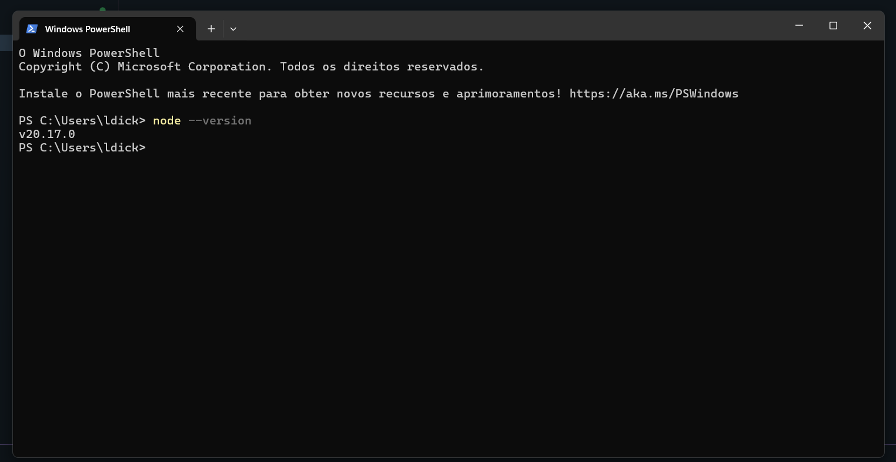
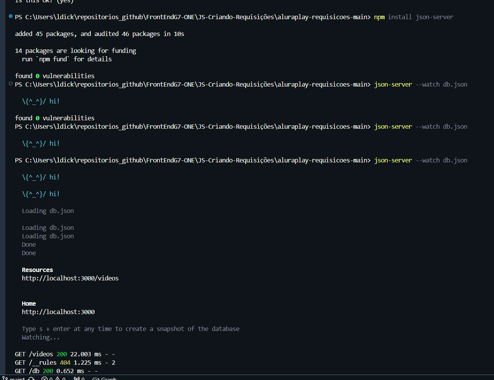

## Exercícios do Curso Javascript: criando requisições.

### Módulo 01 | Simulando uma API

#### Exercícios:

- 1 Criando um ambiente de desenvolvimento com Node.js

// Verificar endereço da imagem. Modificar.
</img>

- 2 Iniciando um servidor local com json-server

</img>
